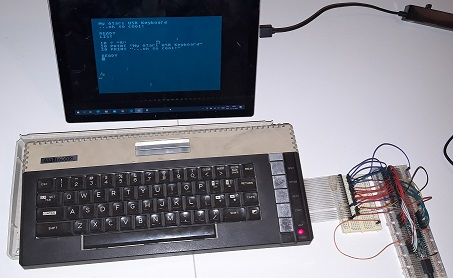

# Atari Keyboard

Convert an Atari 600/800/1200 XL into a USB keyboard.

I bricked my Atari mainboard. My goal is to use the keyboard of the Atari on a Raspberry PI in combination with an Atari emulator (e.g. Atari800).

# Requirements

## Hardware

- Atari XL keyboard
- Teensy 3.6 or compatible (that can identify itself as a HID device)
- USB cable for the Teensy
- A ribbon cable connector, see [this forum discussion](https://atariage.com/forums/topic/249982-xlxe-keyboard-ribbon-socket-replacement/page/3/?tab=comments#comment-4379628)
- Breadboard and jumper wires

## Software

- [Arduino IDE](https://www.arduino.cc/en/software)
- [Teensyduino software addon for the Arduino software](https://www.pjrc.com/teensy/td_download.html)
- [Microsoft Keyboard Layout Creator](https://www.microsoft.com/en-us/download/details.aspx?id=102134) (for Windows only)

# Wiring

Requires the 24-pin ribbon connector pins to be connected to a Teensy 3.6 or compatible board. 

**Important** Please verify that the pinout of your Atari keyboard ribbon is the same, 
I don't know if there exist different variations of the pinout. 
My Ribbon doesn't have a wire for connector 19.

Find RIBBON_01 u/i RIBBON_24 in the source file to see to which Teensy pins I connected the Ribbon. 
Connect ribbon pin 18 to GND and pin 24 to +3.3V. 
I use the Teensy 3.3 output to power the keyboard, please note that most Teensy boards can handle up to 3.3V on the I/O pins.

I also added a 'deadman switch' to enable/disable keyboard functionality of the keyboard in case the keyboard sends funny keystrokes to your PC during development. Wire input PIN_ENABLE_KB to GND to enable the USB Keyboard functionality.

# Special key mappings

Key mappings are optimized for usage with the [Atari800 emulator](https://atari800.github.io/).

| Atari             | USB      |
|-------------------|----------|
| RESET             | F5       |
| OPTION            | F2       |
| SELECT            | F3       |
| START             | F4       |
| HELP              | F6       |
| INVERSE VIDEO     | Tilde(`) |
| CLEAR + modifier  | Home     |
| INSERT + modifier | Insert   |

*NOTE*: Currently the cursor keys are directly mapped as arrow keys, which changes behaviour a bit in comparison to the Atari.
